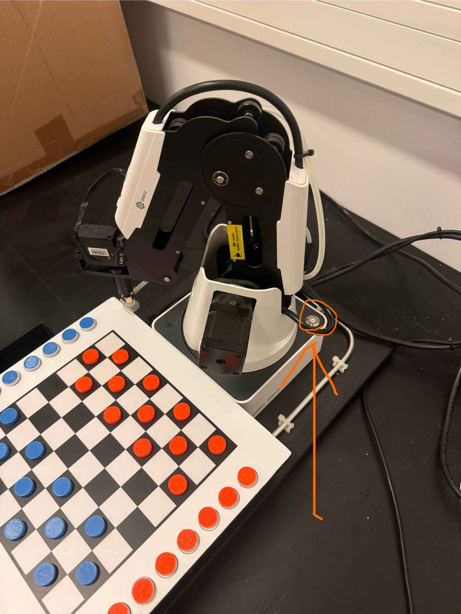
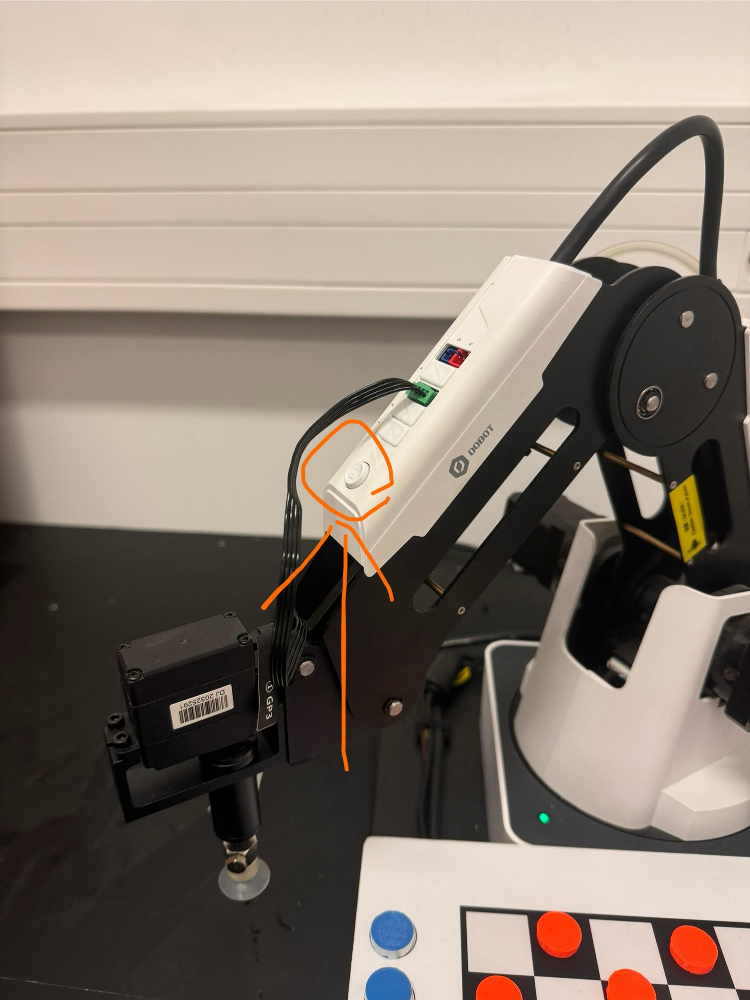
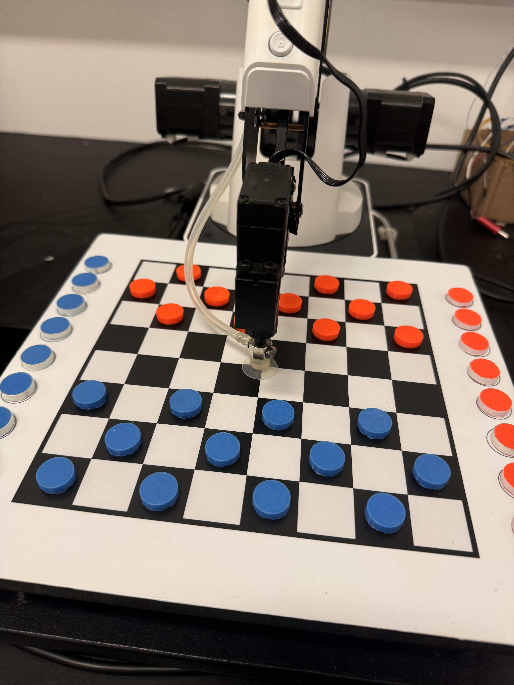
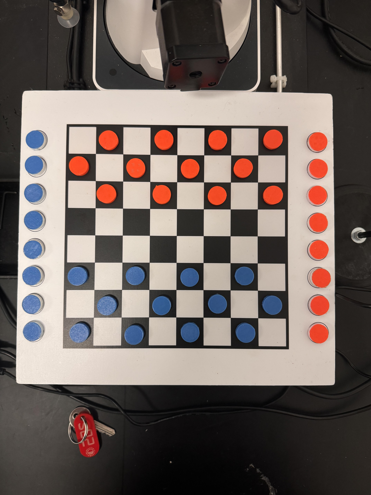

# Checkers robot

Należy przeczytać <ins>*całą*</ins> instrukcję przed rozpoczęciem działania, by uniknąć zbędne problemy i nieprzewidziane zachowanie.
---
W pudełku też znajduje się zestaw pierwszej pomocy w pudełku podpisanym jako "Galadriela"
---
Kontakt w pilnych sytuacjach:
* Nr. telefonu: 796 206 701 

## Instrukacja uruchomienia rozgrywki

### Przed przeprowdzeniem rozgrywki najlepszą decyzją jest przeprowadzenie kalibracji. Instrukcja do kalibracji znajduje się niżej.
---
1. Wypakować robota i kamerkę z pudełka
2. Podłączyć robota do prądu
3. Podłączyć robota oraz kamerkę do laptopu
4. Uruchomić robotą klikając na odpowiedni przycisk (patrz zdjęcie poniżej)

5. 
   1. W przypadku gdy dioda świeci się na czerwono należy ręcznie przemieścić ramię. Możliwe to tylko podczas **ciągłego** przytrzymania przycisku na samym ramieniu (patrz zdjęcie poniżej)
   
   2. Ramie też można przemieszczać w taki sam sposób, gdy jest to niezbędne (np. ustawić pozycję początkową, ustawić w pozycję dla kalibracji)
6. Ustawić ramię na środku planszy, przycisnąć (patrz krok ***5.2*** oraz zdjęcie poniżej)

Jeżeli po uruchomieniu rozgrywki ramię ogchyla się zbyt mocno w przeciwną stronę od planszy lub "nie łapie" pionków czy też nie "trafia" w środek pół -- proces uruchomienia należy zacząć od nowa i zmienić początkowe położenie ramienia przed uruchomieniem skryptu.
1. Uruchomić terminal i przejść do katalogu projektowego na pulpicie
    
    `cd /home/pj-event/Pulpit/checkers-robot/`
2. Wpisać następujące komendy:
    ```bash
    conda activate robot_checkers
    python main_app.py
    ```
3.  Przejść przez menu uruchomenia rozgrywki, w trakcie którego należy wybrać kolor dla robotu, plik konfiguracyjny z położeniami pół, port na którym robot jest podłączony (zazwyczaj jest to jedyna dostępna w menu opcja) oraz port z kamerką (Jeżeli się wybierze złą kamerkę tzn. laptopową, a nie zewnętrzną; należy zatrzymać wykonywanie programu `Ctrl + C` i zacząć od nowa). Aktualnie najlepszą konfiguracją jest config o nazwie `no_use_me_i_am_the_best`. 

    W przypadku, gdy robot gra kolorem pomarańczowym, to rozkład pionków musi wyglądać następująco (patrz zdjęcie poniżej).
    

    W sytuacji, gdy chcemy zmienić kolor dla ramienia, to należy zamienić ze sobą pionki na podstawie kolorów.

4.  Położenie kamerki oraz poziom oświetlenia ma kluczową rolę w płynności rozgrywki.
    
    * Przy słabym poziomie oświetlenia pojawia się problem rozróżnienia kolorów
    * Przy złym położeniu kamerki, program nie widzi całej planszy.
    * Przy zmiennym oświetleniu program przestanie rozpoznawać kolory.
    
    Najlepsze warunki to niezmienne i równomiernie jasne oświetlenie całej planszy.

5.  W trakcie rozgrywki ważnymi oknami są:
    
    * Okno z widokiem z kamerki oraz siatką
    * Okno z stanem gry w postaci obrazka
    * Terminal
  
    Na terminalu możemy pilnować kolejki, legalność ruchów oraz ważne komunikaty, które mogą prosić m.in. o:
        
    * Poprawę nielegalnego ruchu robotu/gracza
    * Oczekiwanie na ruch gracza

6.  W sytuacji gdy robot nie zabrał pionka, by go wyrzucić do ***disposal*** robotowi można pomóc na kilka sposobów:
    1.  Ustawić pionek tak, by ramię go wzięło.
    2.  Wyrzucić pionek do odrzucenia zamiast robotu.
7.  W przypadku, gdy drastycznie się zmieni poziom oświetlenia w trakcie rozgrywki i program ma duże problemy z detekcją kolorów to grę można zatrzymać i uznać wygraną człowiekowi :P
8.  Nie da się rozpocząć rozgrywki od jakiegoś kroku (nie początku gry w warcaby). Anulowanej rozgrywki nie da się uruchomić ponownie, nie możemy cofać ruchy gracza czy komputera.
9.  W aktualnych ustawieniach proponowanym miejscem dla kamerki jest prawa część planszy (patrzymy z perspektywy gracza), aczkolwiek można nią swobodnie manipulować przy ciąglę zmieniającym się oświetleniu.

## Instrukcja kalibracji

Czasem jest potrzebne przeprowadzenie kalibracji położeń pól dla robota. W takim przypadku należy:

1. Ustawić ramię na środku całej planszy (patrz zdjęcie poniżej)

2. Uruchomić skrypt za pomocą komendy:
    
    * Jeżeli środowisko nie jest aktywowane
        ```bash
        conda activate robot_checkers
        python robot_manipulation/calibrate_to_file.py
        ```
    * W przeciwnym przypadku
        ```bash
        python robot_manipulation/calibrate_to_file.py
        ```
3. Uruchomi się skrypt do kalibracji robota. W trakcie skryptu należy wybrać port, do którego jest podłączone ramię (zazwyczaj jest to jedyny dostępny). Kamerki się nie wybiera przy kalibracji.
4. Opcjonalnie można wybrać plik konfiguracyjny, na którym będzie się opierać nowa konfiguracja (Zalecana opcja). 
   
   Aktualnie najlepsza konfiguracja p.d. `no_use_me_i_am_the_best` jest oparta na konfiguracji `use_me_pls`.

5. Uruchomi się okno python'a z czarnym kwadratem. To oznacza, że można przeprowadzić konfigurację. Ramię się ustawi na pole o id 1 (Jest to czarne pole po prawej w pierszym rzędzie ze strony **gracza**). 
6. Konfigurację się przeprowadza za pomocą klawiszy [w, a, s, d, q, e], ruchy są wykonywane z perspektywy robota. Opis ruchów:
    
    * W: do przodu
    * A: w lewo
    * S: do tyłu
    * D: w prawo
    * Q: na dół
    * E: do góry
7. Za dobrze skalibrowane pole należy uznać położenie, w którym, ssawka po dotknięciu pionka jest opuszczona na dół jeszcze **jeden** raz i sama ssawka znajduje się na środku pola (lub najbliżej, według możliwości). 
   
    Podczas konfiguracja należy wypełnić wszystkie możliwe **czarne** pola pionkami. Pola po bokach z piokami z taśmą, które reprezentują damki, też muszą być wypełnione. 

    W tym celu można użyć pudełko z zapasowymi pomarańczowymi pionkami.

8. Gdy uznamy, że pole jest dobrze skalibrowane -- należy kliknąć przycisk `Enter`, wtedy okno się zamknie, robot przejdzie do następnego pola i okno się uruchomi ponowni.

    **WAŻNE:**
    Po akceptacji skalibrowanego pola (tzn. po kliknięciu `Enter`) należy odczekać ~1 sekundy. Jest to ważne, ponieważ na sam koniec skrypt poprosi o wprowadzenie nazwy dla pliku konfiguracyjnego. Jeżeli zbyt wcześnie kliknięliśmy `Enter`, to ten input pójdzie do `std in` i program na etapie podania nazwy się crash`uje.

    Nie jest zalecane agresywne i zbyt częste klikanie w klawisze sterujące lub `Enter`.

    **Input od klawiszy jest rejestrowany tylko wtedy, gdy wybrane jest okno z czarnym kwadratem.**

9.  Ostatnimi dwoma etapami kalibracji jest wskazanie miejsca, gdzie będzie się znajdował koszyk z odrzuconymi pionkami `disposal` oraz położenie "domowe" dla ramienia, które przyjmuje, gdy czeka na ruch gracza.

    Położenie "domowe" musi się znajdować po za widokiem kamery. Tzn. by ramie nie zakrywało sobą planszy.
