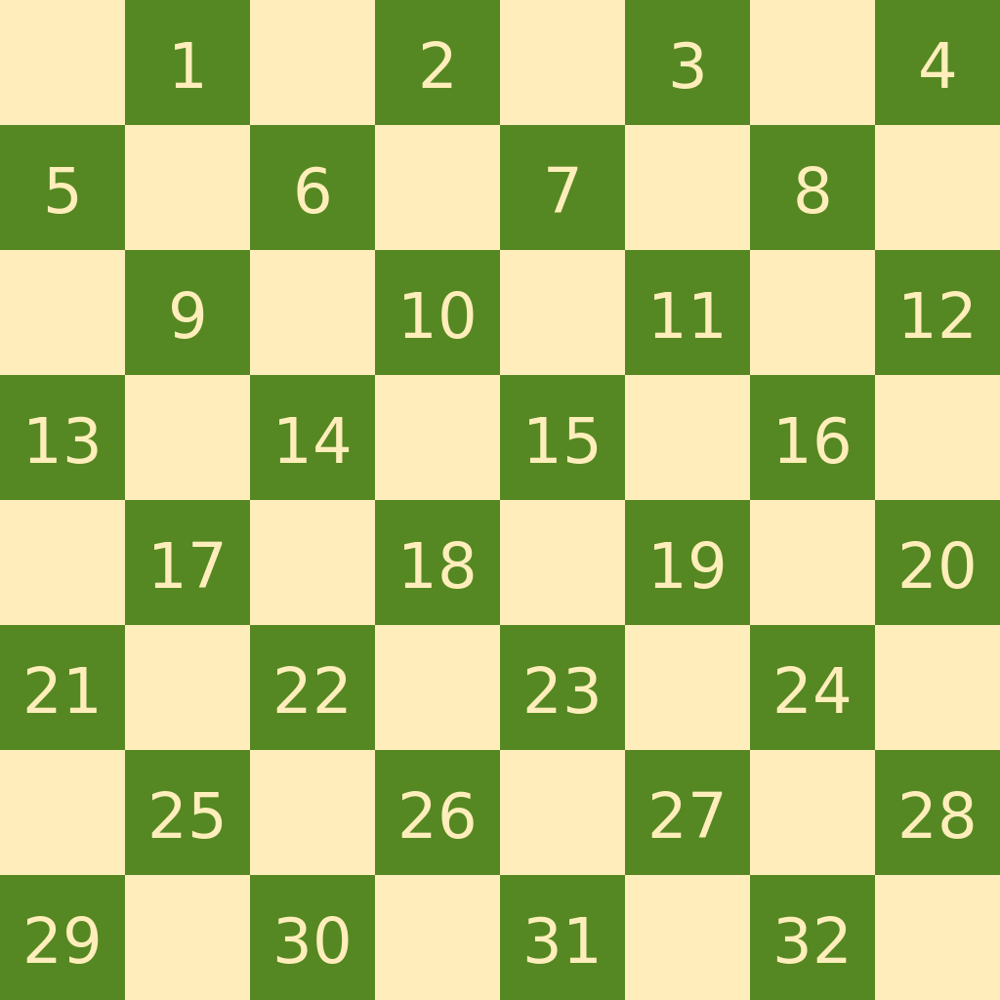

# Rodzaje warcab

1. **Warcaby Polskie/stupolowe/międzynarodowe**
    1. Plansza 10x10
    2. Po 20 pionów
    3. gra się na turniejach
2. **Warcaby amerykańskie**- [wiki](https://en.wikipedia.org/wiki/English_draughts)
    1. Plansza 8x8
    2. Po 12 pionów
    3. Bicie zwykłymi pionkami tylko do przodu
    4. Bicie obowiązkowe, ale nie musi być to możliwe bicie największej ilości pionów przeciwnika
    5. Damka poruszę się/bije też o 1 pole, ale może i do tyłu i do przodu
    6. Obliczone wszystkie ruchy -> [Praca naukowa](http://library.msri.org/books/Book29/files/schaeffer.pdf)
3. **Warcaby klasyczne/brazylijskie** - [wiki](https://en.wikipedia.org/wiki/Brazilian_draughts)
    1. Plansza 8x8
    2. Po 12 pionów
    3. Bicie zwykłymi pionkami na wszystkie strony
    4. Bicie obowiązkowe, obowiązkowa sekwencja zbijająca najwięcej pionów
    5. Damka porusza się o dowolną ilość kroków w dowolną strone
    6. Zasady takie jak w Polskich, tylko plansza mniejsza i mniej pionków

# Zasady gry w szczegółach

## Plansza i notacja

1. Rozmiar: 8x8
2. Pole w lewym dolnym rogu: Czarne - 29
3. Piony koloru: RED (Góra/mniejsze indexy pól); WHITE - u mnie zielone (Dół/większe indexy pól)
4. Po 12 pionków, ułożone na ciemnych polach w pierwszych 3 rzędach

## Warcaby amerykańskie

### Początek

Pierwszy ruch - RED / ciemniejszy kolor

### Ruch

0. **Ogólne**
    1. Bicie jest obowiązkowe
    2. Można wybrać dowolne bicie (nie musi być największe z możliwych) - ale dana sekwencja **musi być dokończona**
1. **Zwykły pion**
    1. Ruch bez bicia możliwy tylko po przekątnych o 1 pole w stronę przeciwnika na wolne pole
    2. Bicie możliwe jest tylko po przekątnej w przód, na wolne pole zaraz za przeciwnikiem. Zbity pion jest ściągany z planszy **po zakończeniu ruchu**
    3. Bicie wielokrotne - możliwe jeśli po pierwszym biciu jest możliwe inne bicie
    4. Zakończenie ruchu na lini przeciwnika powoduje, że pion zamienia się w damkę
2. **Damka**
    1. Ruch bez bicia możliwy tylko po przekątnych o 1 pole w dowolną stronę na wolne pole
    2. Bicie możliwe po przekątnej w dowolną stronę, na wolne pole zaraz za przeciwnikiem. Zbity pion jest ściągany z planszy **po zakończeniu ruchu** - możliwa sytuacja, gdzie już wcześniej zbity ale nie ściągnięty pion blokuje zbicie innego piona
    3. Bicie wielokrotne - możliwe jeśli po pierwszym biciu jest możliwe inne bicie

### Kryteria zwycięstwa

1. Brak pionków u jednego z graczy -> zwycięstwo przeciwnika
2. Brak możliwości wykonania następnego ruchu przez jednego z graczy -> zwycięstwo przeciwnika
3. Jeśli żaden gracz nie może osiągnąć zwycięstwa, lub ustalenie remisu - remis

## Warcaby klasyczne/brazylijskie

### Początek

Pierwszy ruch - WHITE/Green / jaśniejszy kolor

### Ruch

0. **Ogólne**
    1. Bicie jest obowiązkowe
    2. **Trzeba** wybrać sekwencję bicia o największej ilości zbitych pionów przeciwnika - spośród różnych o tej samej liczbie zbić można wybrać
1. **Zwykły pion**
    1. Ruch bez bicia możliwy tylko po przekątnych o 1 pole w stronę przeciwnika na wolne pole
    2. Bicie możliwe jest po przekątnej w dowolną stronę, na wolne pole zaraz za przeciwnikiem. Zbity pion jest ściągany z planszy **po zakończeniu ruchu**. Zbity pion może być zbity tylko raz, możliwa jest sytuacja, gdzie zbity ale nie ściągnięty pion blokuje bicie innych pionów
    3. Bicie wielokrotne - możliwe oraz obowiązkowe jeśli po pierwszym biciu jest możliwe inne bicie
    4. **Zakończenie** ruchu na lini przeciwnika powoduje, że pion zamienia się w damkę. Jeśli tylko przeskakiwał przez to pole nie staje się damką
2. **Damka**
    1. Ruch bez bicia możliwy tylko po przekątnych o dowolną ilość pól w dowolną stronę na wolne pole
    2. Bicie możliwe po przekątnej w dowolną stronę, na dowolną odległość, na jedno z wolnych pól za przeciwnikiem. Zbity pion jest ściągany z planszy **po zakończeniu ruchu** - możliwa sytuacja, gdzie już wcześniej zbity ale nie ściągnięty pion blokuje zbicie innego piona
    3. Bicie wielokrotne - możliwe oraz konieczne jeśli po pierwszym biciu jest możliwe inne bicie

### Kryteria zwycięstwa

1. Brak pionków u jednego z graczy -> zwycięstwo przeciwnika
2. Brak możliwości wykonania następnego ruchu przez jednego z graczy -> zwycięstwo przeciwnika
3. Jeśli żaden gracz nie może osiągnąć zwycięstwa, lub ustalenie remisu - remis
4. Jeśli po raz 3 powtórzy się sytuacja na planszy (nie koniecznie 3 pod rząd), w której takie same jest ułożenie pionków jak i ten sam gracz wykonuje następny ruch - **remis**

## Główne różnice odmiany amerykańskiej vs klasycznej

1. W odmianie amerykańskiej zwykły pion nie może bić do tyłu
2. W odmianie amerykańskiej damka porusza się o 1 pole
3. W odmianie amerykańskiej nie trzeba wykonywać sekwencji z najwięszką ilością zbić

# Finalny wybór do projektu

Finalny wybór padł na odmianę ***Klasyczną/brazylijską*** z racji na:

- Ograniczenie sekwencji do tej z największą ilością zbić
- Zasadach takich samych jak w odmianie Polskiej/międzynarodowej przy zachowaniu planszy 8x8
- Większej możliwości zderzenia rozwiązania z graczami trenującymi odmianę Polską w ramach ewauluacji projektu
